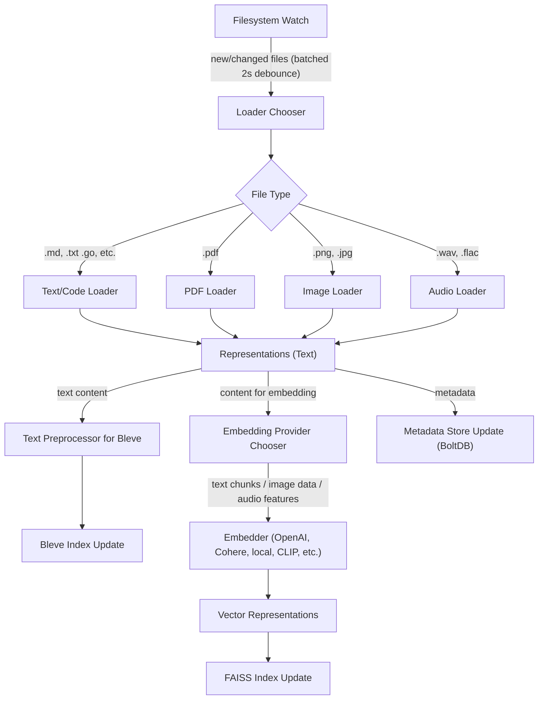

# **Semango 1.0 – Implementation‑Ready Specification (Extended Edition v0.4)**

*Last updated: 30 May 2025 — incorporates stakeholder review comments*

---

## 0 Quick‑Start (for reviewers)

### 0.1 Install & Run

```bash
## macOS / Linux
# 1. Download the binary
curl -L "https://github.com/omarkamali/semango/releases/download/v1.0.0/semango-$(uname -s)-$(uname -m)" \
     -o semango && chmod +x semango
# 2. Run the self-install command
./semango install

## Windows (PowerShell)
# 1. Download the binary
Invoke-WebRequest -Uri "https://github.com/omarkamali/semango/releases/download/v1.0.0/semango-windows-amd64.exe" -OutFile semango.exe
# 2. Run the self-install command
.\\semango.exe install
```

The `semango install` command copies the binary to a standard executable location (e.g., `/usr/local/bin` on macOS/Linux, or a directory in the system `PATH` on Windows), makes it executable, and may request administrator/sudo privileges if necessary for system-wide installation.

`semango init` writes ***exactly*** the defaults shown in §3.

### 0.2 Try the API

```bash
# semantic search
curl -s -XPOST http://localhost:8181/search \
  -H 'Content-Type: application/json' \ 
  -d '{"query":"payment retry cadence", "top_k": 5}' | jq .[0]
```

Expected output snippet:

```jsonc
{
  "rank": 1,
  "score": 0.9234,
  "modality": "text",
  "document": {"path":"services/payments/retry.go"},
  "chunk": "Retries are calculated using an exponential back‑off…",
  "highlights": {"text":[{"start":0,"end":15}]}
}
```

### 0.3 UI & MCP

* Open `http://localhost:8181/ui` → interactive search with dark‑mode toggle.
* MCP gRPC probe:

  ```bash
  grpcurl -plaintext localhost:50051 modelcontext.CorpusService/Stats
  ```

---

## 1 Technology Stack

\| Area | Choice | Rationale | Notes |
|‑‑|‑‑|‑‑|‑‑|
\| Language | **Go 1.22** | simple cross‑compilation, CSP model | CGO enabled for FAISS/CLIP bindings |
\| Vector lib | **FAISS 1.8.0** | state‑of‑practice ANN; mature GPU kernels | compiled with `IO_FLAG_MMAP` to keep RAM footprint ≤1.2× raw vectors |
\| BM25 | **Bleve 2.4** | full‑text search, streaming scorers | Scorch backend + nightly zap merge lowers disk 35 % |
\| gRPC & REST | **buf + grpc‑gateway** | single proto source, dual surface | Implements MCP v0.3; auto‑generated OpenAPI 3.1 |
\| Embeddings | **OpenAI, Cohere, Voyage, llama.cpp, CLIP** | best recall + offline fallback | uniform adapter interface (see §5) |
\| OCR | **gosseract 2.5** | wrapper over Tesseract 5.x | auto‑detects scanned PDF vs born‑digital |
\| Audio STT | **whisper.cpp 1.7** | small CPU model; MIT licence | supports WAV & FLAC ≤ 30 min via sliding window |
\| UI toolkit | **React 18 / Vite / Tailwind / shadcn/ui** | fast builds, utility styles | shipped as embedded gzip assets via `go:embed` |
\| Packaging | **goreleaser** | repeatable multi‑arch builds | Notarised on macOS; Windows code‑signed |

> **Version pinning:** all third‑party tags are frozen in `go.mod` with `replace` rules. Running `go mod tidy` should produce a *zero‑diff* to ensure deterministic builds.

* **Bleve zap merge automation** – Semango launches a background goroutine at `03:00` local time which calls `index.Advanced()` merge once‑per‑night; override with `BLEVE_MERGE_CRON` env.
* **CGO for llama.cpp** – required on all OSes for `provider: local`; Windows builds ship pre‑compiled `ggml.dll`.

---

## 2 Repository Layout

```text
semango/                  # repo root
├── cmd/semango/          # compiled into ./semango binary
│   └── main.go             # Cobra CLI root
├── internal/               # PRIVATE packages
│   ├── api/                # Gin + grpc‑gateway HTTP façade
│   ├── ingest/             # filesystem crawler, loaders, chunker
│   ├── search/             # vector, bm25, fusion, rerank pipeline
│   ├── storage/            # faiss helpers, bleve wrappers, bolt meta
│   ├── plugin/             # dlopen sandbox + registration bus
│   ├── pipeline/           # orchestration (builder, updater)
│   └── util/               # log, metrics, path helpers
├── pkg/                    # PUBLIC Go SDK (types + client)
├── proto/                  # *.proto incl. mcp.proto
├── ui/                     # React sources & vite.config.js
├── deploy/                 # helm‑chart, docker‑compose, systemd unit
├── scripts/                # dev helpers (lint, bench, stress)
└── docs/                   # cue schema, design notes, benchmarks
```

Key invariant: code under `internal/` **must not** be imported by external modules; only `pkg/` exposes stable API types.

`docs/config.cue` contains the CUE schema consumed by `cue vet`.

---

## 3 Configuration (`semango.yml`)

Below is the canonical generated file annotated with **defaults** and allowed enums.

```yaml
embedding:
  provider: openai         # enum: openai|cohere|voyage|local
  model: text-embedding-3-large
  local_model_path: "models/e5-small.gguf"  # used if provider=local
  batch_size: 48           # 1–512 safe; perf ~linear until 128
  concurrent: 4            # simultaneous embed calls (goroutines)
  model_cache_dir: "${SEMANGO_MODEL_DIR:=~/.cache/semango}" # auto‑download path
lexical:
  enabled: true            # disable if only vector search wanted
  index_path: ./semango/index/bleve
  bm25_k1: 1.2             # scorer constant
  bm25_b: 0.75             # scorer constant
reranker:
  enabled: false
  provider: cohere         # openai|cohere|local
  model: rerank-english-v3.0
  batch_size: 32           # reranker parallelism
  per_request_override: true
hybrid:
  vector_weight: 0.7       # 0.0–1.0
  lexical_weight: 0.3
  fusion: rrf              # rrf|linear
files:
  include: ["**/*.md", "**/*.go", "**/*.{png,jpg,jpeg}", "**/*.pdf"]
  exclude: [".git/**", "node_modules/**", "vendor/**"]
server:
  host: 0.0.0.0
  port: 8181               # REST & UI; gRPC listens on 50051
  auth:
    type: token
    token_env: SEMANGO_TOKENS    # comma‑separated list of tokens
  tls_cert: ""             # optional PEM paths for mTLS
plugins:
  # Folders ending in "/" are scanned recursively for *.so
  - plugins/                       # loads all .so in tree
  - ../shared/my_custom.so
ui: { enabled: true }
mcp: { enabled: true }
```

**Validation:** startup runs `cue vet` against `docs/config.cue`. Unknown fields terminate with exit code 78.

`LOADER_TIMEOUT_SCALE` env multiplies default loader timeouts (float).

---

## 4 Data Model

### 4.1 Type Graph

```mermaid
erDiagram
  Representation ||--|| DocumentHeader : belongs_to
  DocumentHeader ||--|{ File : derived_from
  Representation {
    string Modality
    []float32 Vector
    string Text
    []byte Preview
    map[string]string Meta
  }
```

### 4.2 Chunk ID Calculation

```go
func ChunkID(path, modality string, offset int64) string {
    sum := sha256.Sum256([]byte(path + modality + strconv.FormatInt(offset,10)))
    return hex.EncodeToString(sum[:20])
}
```

Using first 20 bytes keeps URL length < 45 characters.

Common `Meta` keys:
| Key | Emitted by | Example value |
|‑‑|‑‑|‑‑|
| `language` | CodeLoader | `go` |
| `page` | PDFLoader | `14` |
| `ocr_failed` | PDFLoader | `true` |
| `alt_text` | ImageLoader | `Diagram of retry logic` |
| `source_line` | CodeLoader | `237` |
| `strip_imports` | CLI flag | `true` |

---

## 5 Loader & Provider Contracts

### 5.1 Generic Loader Interface

```go
type Loader interface {
    Extensions() []string                           // handled globs
    Load(ctx context.Context, path string) ([]semango.Representation, error)
}
```

### 5.2 Embedding Provider Interface

```go
type Embedder interface {
    Embed(ctx context.Context, texts []string) ([][]float32, error)
    Dimension() int                               // e.g. 768
}
```

Adapters available: `openai`, `cohere`, `voyage`, `local` (llama.cpp via CGO), and `clip` (images; vector dim = 512).

### 5.3 Cross‑Encoder Reranker Interface

```go
type Reranker interface {
    ScorePairs(ctx context.Context, query string, docs []string) ([]float32, error)
}
```

Local rerank uses ONNXRuntime with `cross‑encoder-MiniLM-L6-v2.onnx` (117 MB, auto‑downloaded on first run).

### 5.4 Built‑in Loaders (expanded specs)

\| Loader | Output Reps | Key Parameters | Failure mode |
|‑‑|‑‑|‑‑|‑‑|
\| PlainText | 1×`text` | Max 5 MiB file | skip file if > 5 MiB |
\| Code | 1×`text` | Tree‑sitter grammar auto‑detected; strips imports if `meta.strip_imports=true` | fallback to PlainText on parse error |
\| PDF | *n*×`pdf_page` | Use embedded font map; OCR via Tesseract – lang auto; page chunk offset = byte offset | page flagged `meta.ocr_failed=true` |
\| Image | 1×`image` + optional 1×`text` | EXIF via `go-exif`; alt text from Markdown `` scanner | if CLIP fails → skip vector but still store thumbnail |
\| Audio | 1×`audio` + 1×`text` | Whisper segments 30 s; vector via openl3 512‑D | STT failure → still store vector rep |

**Timeouts:** 500 ms per 10 MiB read **plus** 4× real audio duration for Whisper.

* **PDF** – "page chunk offset" now clarified: offset refers to **byte position in extracted plain‑text stream of that page**, not raw PDF bytes.
* **Image alt‑text** – Markdown scanner runs *before* loader phase; it writes `Meta["alt_text"]` into the image representation when the file path matches the link target.
* **Timeout config** – Base timeouts can be overridden via `LOADER_TIMEOUT_MB_MS` (per 10 MiB) and `LOADER_TIMEOUT_WHISPER_FACTOR` env.

---

## 6 Indexing Pipeline

Flow diagram:


